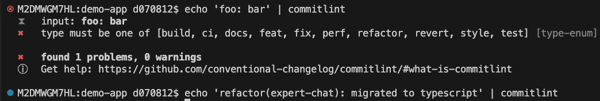
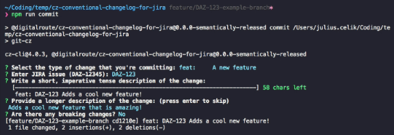
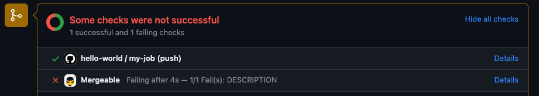
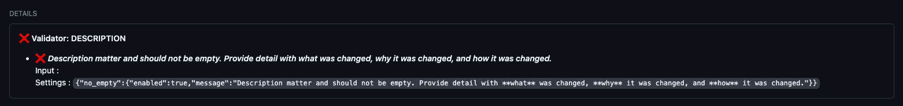

# Conventional commit

It is specification that provides set of rules for creating explicit commit history. It makes easier for developers to contribute, by allowing them to explore a more structured commit history. Also it allow some automation like
automatic CHANGELOGs generation or automatic version bumps.

Normal structure look like this:
`type(scope?): subject`

- type: build, chore, ci, docs, feat, fix, perf, refactor, revert, style, test
- scope: project name, issue id
- subject: description of what have been done

Some examples would be:

`chore: run tests on expert-chat ci`
`fix(BDS-1234): send X-USER-ID header`

## Implementation

### [commitlint](https://github.com/conventional-changelog/commitlint)

- enforce/warn configurable lint rules for following conventional commit.

- tooling (helper): [Commitizen](https://commitizen.github.io/cz-cli/) for CLI and VScode

  

- also with [JIRA support](https://www.npmjs.com/package/@digitalroute/cz-conventional-changelog-for-jira?activeTab=readme)

  

  `type(scope): JIRA-1234 commit subject`

# Pull Requests guidelines - Implementation

### [mergeable](https://mergeable.readthedocs.io/en/latest/index.html)

- define configurable rules in yml
- don't allow PR with empty description
- don't allow PR with not proper title
  
  

Uberbot already contains mergeable config: https://github.tools.sap/dsx/uberbot/blob/85ee6ecd42359bb6c67e0bdf28efc74547ce461b/.github/mergeable.yml
